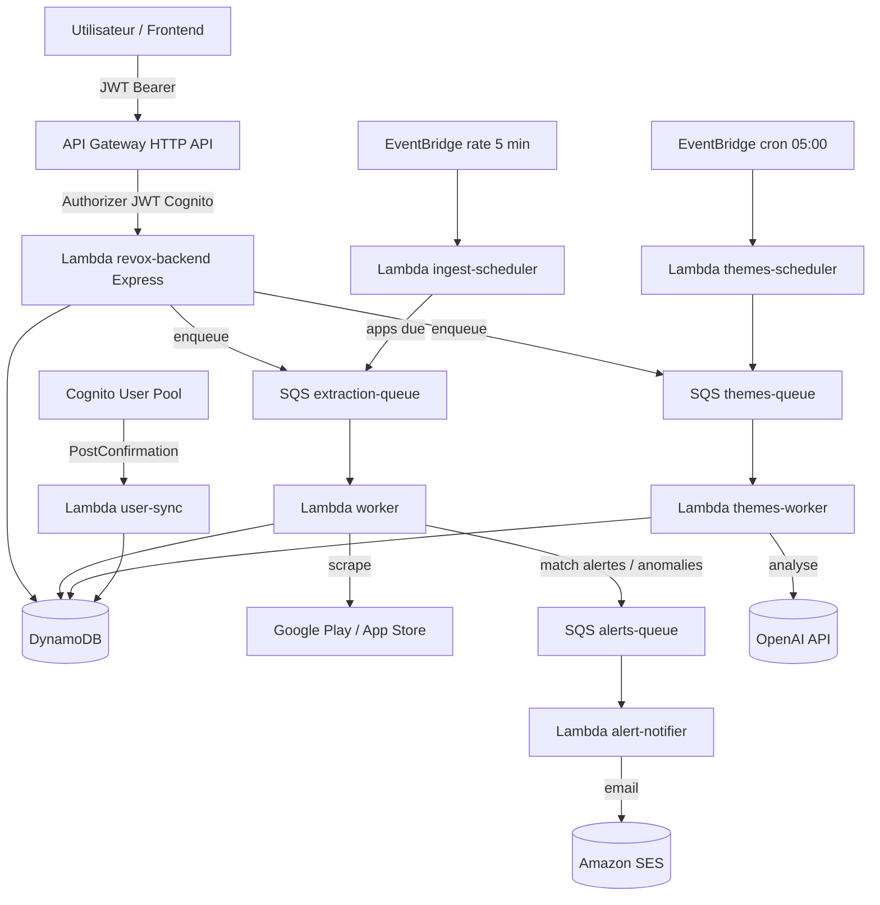
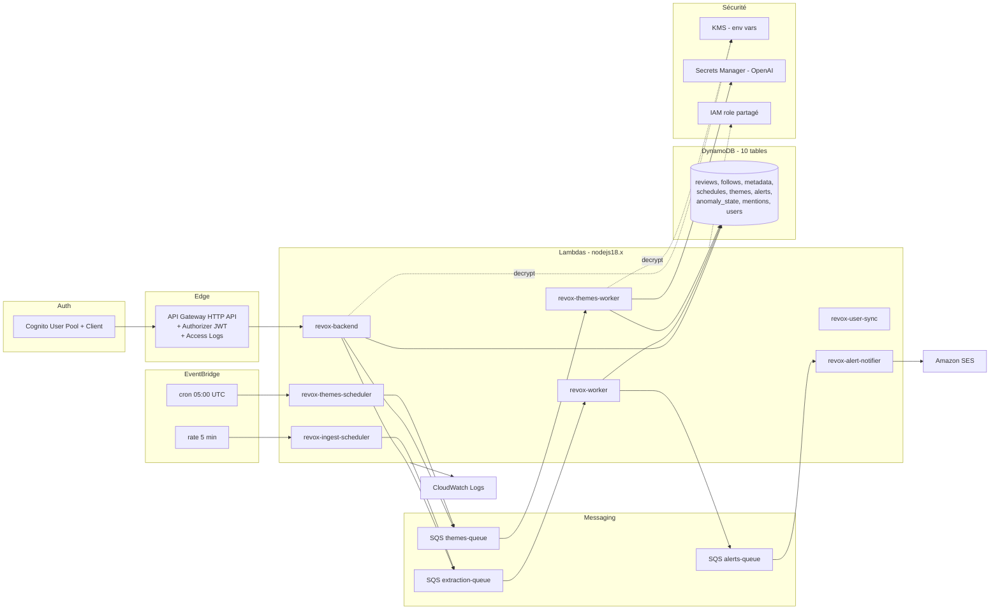

# 📱 Revox — Backend & Infrastructure

**Revox** est un SaaS B2B qui aide les équipes Produit, Marketing et Digital à **surveiller et exploiter les avis d'applications mobiles** publiés sur l'**App Store (iOS)** et le **Google Play Store (Android)**.

Ce dépôt contient le **backend serverless** (API + workers Node.js) et l'**infrastructure AWS** (Terraform). Le frontend est un projet séparé.

> 📄 Un audit technique complet du backend et de l'infrastructure est disponible dans [`AUDIT.md`](./AUDIT.md). Il est recommandé de le lire avant toute évolution.

---

## Sommaire

- [Présentation du produit](#présentation-du-produit)
- [Architecture](#architecture)
- [Stack technique](#stack-technique)
- [Installation locale](#installation-locale)
- [Variables d'environnement](#variables-denvironnement)
- [Déploiement](#déploiement)
- [Infrastructure AWS](#infrastructure-aws)
- [Terraform](#terraform)
- [API](#api)
- [Modèle de données (DynamoDB)](#modèle-de-données-dynamodb)
- [Monitoring](#monitoring)
- [Alerting](#alerting)
- [Troubleshooting](#troubleshooting)
- [Roadmap](#roadmap)

---

## Présentation du produit

Revox permet de :

- **Rechercher** une application par son nom (iOS et/ou Android) et la **suivre**.
- **Extraire automatiquement** les avis des stores et les stocker.
- **Consulter et exporter** les avis (texte, note, date, version, auteur, plateforme) — export CSV par plage de dates.
- **Analyser les avis** : mots et expressions les plus fréquents, et **axes thématiques** (positifs / négatifs) générés par un LLM.
- **Détecter des anomalies** : pic anormal de volume, hausse anormale d'avis négatifs.
- **Créer des alertes** (mots-clés, note plancher, nouveaux avis) et recevoir des **notifications email**.
- **Fusionner** les fiches iOS et Android d'une même application pour une analyse unifiée.

**Cible** : Product Owners, Product Managers, CPO, responsables Digitaux et Marketing.

---

## Architecture

### Architecture logique



### Architecture d'infrastructure AWS



> ℹ️ Les Lambdas tournent actuellement en `nodejs18.x` et partagent un rôle IAM unique. Voir [`AUDIT.md`](./AUDIT.md) (A-01, A-10) pour les recommandations.

---

## Stack technique

| Couche | Technologie |
|---|---|
| Langage | Node.js (ESM majoritaire), Express 5 |
| API | AWS API Gateway **HTTP API** (v2) + intégration proxy Lambda |
| Auth | AWS Cognito (User Pool + client web) — JWT `access` token |
| Compute | AWS Lambda (`@vendia/serverless-express` pour l'API) |
| Base de données | AWS DynamoDB (10 tables, mode `PAY_PER_REQUEST`) |
| Messaging | AWS SQS (3 files) |
| Planification | AWS EventBridge (2 règles) |
| Email | AWS SES |
| Secrets | AWS Secrets Manager (clé OpenAI) + KMS (variables d'env) |
| Analyse LLM | OpenAI Chat Completions (`gpt-4o-mini` par défaut) |
| Scraping stores | `google-play-scraper`, `app-store-scraper` + appels iTunes/Play |
| IaC | Terraform (backend d'état S3 + lock DynamoDB) |
| CI/CD | GitHub Actions (build esbuild → `aws lambda update-function-code`) |

---

## Installation locale

```bash
git clone https://github.com/kejji/revox.git
cd revox

# 1) Provisionner l'infrastructure (voir section Terraform)
cd infra
terraform init
terraform apply

# 2) Générer le fichier .env du backend à partir des outputs Terraform
./generate-env.sh        # écrit ../backend/.env

# 3) Lancer le backend en local
cd ../backend
npm install
LOCAL=true npm run dev   # API sur http://localhost:4000
```

> Le backend a besoin d'identifiants AWS valides (profil CLI) pour accéder à DynamoDB/SQS/SES/Secrets Manager, même en local. `npm run dev` exécute `node app.js` ; le serveur écoute sur le port `4000` lorsque `LOCAL=true`.

---

## Variables d'environnement

Le backend est entièrement piloté par variables d'environnement (injectées par Terraform en production, ou via `generate-env.sh` en local). Principales variables :

| Variable | Description |
|---|---|
| `AWS_REGION` | Région AWS (défaut `eu-west-3`). |
| `COGNITO_USER_POOL_ID` / `COGNITO_APP_CLIENT_ID` | Vérification des JWT. |
| `APP_REVIEWS_TABLE` | Table des avis (`revox_app_reviews`). |
| `USER_FOLLOWS_TABLE` | Table des suivis (`revox_user_follows`). |
| `APPS_METADATA_TABLE` | Métadonnées des apps. |
| `APPS_INGEST_SCHEDULE_TABLE` | Planning d'ingestion. |
| `APPS_THEMES_TABLE` / `APPS_THEMES_SCHEDULE_TABLE` | Analyses de thèmes + planning. |
| `ALERTS_TABLE` | Alertes utilisateur. |
| `ANOMALY_STATE_TABLE` | État de détection d'anomalies. |
| `FREQUENT_MENTIONS_TABLE` | Résultats mots/expressions fréquents. |
| `REVOX_USERS_TABLE` | Utilisateurs (trigger Cognito). |
| `EXTRACTION_QUEUE_URL` / `THEMES_QUEUE_URL` / `ALERTS_QUEUE_URL` | Files SQS. |
| `DEFAULT_INGEST_INTERVAL_MINUTES` | Cadence d'ingestion par défaut. |
| `SCHED_BATCH_SIZE` / `SCHED_LOCK_MS` | Paramètres du scheduler d'ingestion. |
| `THEMES_DEFAULT_INTERVAL_MINUTES` / `THEMES_SCHED_BATCH_SIZE` / `THEMES_SCHED_LOCK_MS` | Paramètres du scheduler de thèmes. |
| `OPENAI_SECRET_NAME` | Nom du secret Secrets Manager contenant la clé OpenAI. |
| `OPENAI_URL` / `OPENAI_MODEL` | Endpoint et modèle OpenAI. |
| `SES_FROM_EMAIL` | Adresse expéditrice vérifiée dans SES. |
| `LOCAL` | `true` pour démarrer le serveur HTTP local. |

> ⚠️ Le fichier `backend/.env.example` actuel est incomplet (4 variables). La liste ci-dessus fait foi. `backend/.env` est ignoré par Git.

---

## Déploiement

Le déploiement du code est **découplé** de Terraform :

- **Terraform** crée et configure les ressources (y compris les Lambdas, initialisées avec un `dummy.zip`). Les Lambdas ont `lifecycle { ignore_changes = [filename, source_code_hash] }`, donc Terraform ne touche pas au code après création.
- **GitHub Actions** (`.github/workflows/deploy.yml`) build et déploie le code réel à chaque push sur `main` modifiant `backend/**` :
  1. `npm ci` + bundling **esbuild** de chaque entrypoint (`index`, `worker`, `userSync`, `ingestScheduler`, `themesWorker`, `themesScheduleRunner`, `alertNotifier`).
  2. Packaging d'un zip unique `revox-backend.zip`.
  3. `aws lambda update-function-code` sur les 7 fonctions.

Secrets GitHub requis : `AWS_ACCESS_KEY_ID`, `AWS_SECRET_ACCESS_KEY`.

> Note : un même artefact est déployé sur les 7 Lambdas (chaque fonction n'exécute que son handler). Voir `AUDIT.md` (A-11) pour l'optimisation par fonction.

---

## Infrastructure AWS

| Catégorie | Ressources |
|---|---|
| **API** | 1 HTTP API (`revox-api`), authorizer JWT Cognito, routes `GET /health` (public), `ANY /` et `ANY /{proxy+}` (JWT), `OPTIONS /{proxy+}` (préflight). Access logs vers CloudWatch. |
| **Compute** | 7 Lambdas (cf. tableau d'architecture). |
| **Données** | 10 tables DynamoDB `PAY_PER_REQUEST`. |
| **Messaging** | 3 files SQS (extraction / themes / alerts). |
| **Auth** | 1 Cognito User Pool + client web (sans secret), trigger PostConfirmation. |
| **Planification** | 2 règles EventBridge (`rate(5 minutes)` ingestion, `cron(0 5 * * ? *)` thèmes). |
| **Sécurité** | 1 rôle IAM d'exécution partagé, 1 clé KMS (chiffrement des env vars, rotation activée), Secrets Manager (clé OpenAI). |
| **Email** | Amazon SES (`ses:SendEmail`). |
| **Observabilité** | Log Groups CloudWatch (rétention 14 j pour `revox-backend` et l'API). |
| **Région** | `eu-west-3` (Paris). |

---

## Terraform

```bash
cd infra
terraform init      # backend S3 : revox-terraform-state, lock : revox-terraform-locks
terraform plan
terraform apply
```

- **État distant** : S3 `revox-terraform-state` (versioning activé, `prevent_destroy`), verrou DynamoDB `revox-terraform-locks` (cf. `backend.tf`).
- **Variables principales** (`variables.tf`) : `aws_region` (`eu-west-3`), `aws_profile` (`revox-admin`), `default_ingest_interval_minutes` (30), `ingest_scheduler_rate_expression` (`rate(5 minutes)`), `openai_secret_name` / `openai_model` / `openai_url`, `themes_default_interval_minutes` (1440), `ses_from_email`.
- **Outputs** (`outputs.tf`) : IDs Cognito, noms de tables, URLs/ARNs de files SQS, endpoint de l'API, paramètres OpenAI — consommés par `generate-env.sh`.

> Le bootstrap (bucket d'état + table de lock) est défini dans le même état que les ressources applicatives. Voir `AUDIT.md` (A-18) pour la modularisation recommandée.

---

## API

Toutes les routes (hors `GET /health`) requièrent un en-tête `Authorization: Bearer <JWT>`.

**Recherche & suivi** — `GET /search-app?query=...` · `POST /follow-app` · `GET /follow-app` · `DELETE /follow-app` · `PUT /follow-app/mark-read` · `POST /apps/merge` · `DELETE /apps/merge`

**Avis** — `GET /reviews?app_pk=...&limit=&order=&cursor=` (pagination par curseur, mono ou multi-apps) · `GET /reviews/export?app_pk=...&from=&to=&order=` (CSV streamé) · `POST /reviews/ingest`

**Planification d'ingestion** — `GET /ingest/schedule` · `PUT /ingest/schedule` · `GET /ingest/schedule/list`

**Analyse de thèmes** — `POST /themes/enqueue` · `GET /themes/status` · `GET /themes/result` · `GET /themes/schedule` · `PUT /themes/schedule` · `GET /themes/schedule/list`

**Alertes** — `POST /alerts` · `GET /alerts` · `PUT /alerts/:alertId` · `DELETE /alerts/:alertId`

**Mentions fréquentes** — `POST /mentions/generate` · `GET /mentions/result`

> Convention de clé d'application : `app_pk = "<platform>#<bundleId>"` (ex. `android#com.fortuneo.android`). Encoder le `#` en `%23` dans les URLs. Pour le multi-apps, séparer par des virgules.

---

## Modèle de données (DynamoDB)

| Table | PK | SK | GSI |
|---|---|---|---|
| `revox_users` | `id` | — | — |
| `revox_user_follows` | `user_id` | `app_pk` | `GSI1 (app_pk, user_id)` |
| `apps_metadata` | `app_pk` | — | — |
| `revox_app_reviews` | `app_pk` | `ts_review` | — |
| `apps_ingest_schedule` | `app_pk` | — | `gsi_due (due_pk, next_run_at)` |
| `apps_themes` | `app_pk` | `sk` (`pending#day#job` / `theme#day#job`) | — |
| `apps_themes_schedule` | `app_pk` | — | `gsi_due (due_pk, next_run_at)` |
| `revox_alerts` | `user_id` | `alert_id` | `GSI_AppAlerts (app_pk, alert_id)` |
| `revox_anomaly_state` | `app_pk` | — | — |
| `revox_frequent_mentions` | `app_pk` | `computed_at` | — |

La clé de tri des avis est `ts_review = "<date ISO>#<hash FNV-1a(date,texte,auteur)>"`, garantissant l'**unicité et l'idempotence** de l'ingestion (écriture conditionnelle `attribute_not_exists`).

---

## Monitoring

- **Logs** : CloudWatch Logs. Les workers et schedulers émettent des **logs structurés JSON** (`event`, `app_pk`, compteurs). La Lambda API et l'API Gateway disposent de Log Groups dédiés (rétention 14 jours).
- **Métriques** : métriques Lambda/SQS/DynamoDB/API Gateway natives disponibles dans CloudWatch (detailed metrics activées sur l'API).

> ⚠️ **État actuel** : aucune **alarme** CloudWatch ni **dashboard** n'est défini dans l'IaC. La mise en place d'alarmes (erreurs Lambda, âge des messages SQS, profondeur DLQ, 5XX API) est une **priorité court terme** — voir `AUDIT.md` (A-16).

---

## Alerting

Deux mécanismes, tous deux aboutissant à un email SES via `revox-alert-notifier` :

1. **Alertes par critère** (`review_match`) — évaluées par le `worker` à chaque ingestion : correspondance de **mots-clés**, **note plancher** (`max_rating`), ou **tout nouvel avis** (`trigger_on_new_review`).
2. **Anomalies** (`review_anomaly`) — détectées par `reviewAnomalyDetector` : **pic de volume** (accélération ≥ ×3) ou **hausse du taux d'avis négatifs** (+30 points). État suivi dans `revox_anomaly_state`.

Les correspondances sont mises en file (`alerts-queue`) puis transformées en email par `alert-notifier`.

---

## Troubleshooting

| Symptôme | Pistes |
|---|---|
| **Aucun avis ingéré** | Vérifier les logs de `revox-worker` (`ingestion.window.computed`, `ingestion.result`) ; le scraping store a pu échouer (`google-play-scraper` / `app-store-scraper` peuvent casser si les stores changent). Vérifier `next_run_at` dans `apps_ingest_schedule`. |
| **Analyse de thèmes bloquée en `pending`** | Vérifier les logs de `revox-themes-worker` ; une erreur OpenAI marque le pending en `failed` (visible via `GET /themes/result?...&job_id=...`). Vérifier `OPENAI_SECRET_NAME` et la validité de la clé. |
| **Emails non reçus** | Vérifier que `SES_FROM_EMAIL` est vérifié dans SES et que le compte n'est pas en sandbox ; consulter les logs de `revox-alert-notifier`. |
| **401 Unauthorized** | JWT expiré ou audience/issuer incohérents ; vérifier `COGNITO_USER_POOL_ID` et `COGNITO_APP_CLIENT_ID`. |
| **Message SQS retraité / email en double** | Visibilité SQS = timeout Lambda (cf. `AUDIT.md` A-04) ; un traitement long peut provoquer une re-livraison. |
| **Erreur 500 sur `/reviews`** | Vérifier le format de `app_pk` (`<platform>#<bundleId>`, `#` encodé en `%23`). |

---

## Roadmap

La feuille de route priorisée (court / moyen / long terme) est détaillée dans [`AUDIT.md`](./AUDIT.md#5-dette-technique--roadmap-priorisée). En résumé :

- **Court terme** : DLQ + gestion des erreurs des workers, visibilité SQS, idempotence des emails, PITR DynamoDB, suppression du log de secret.
- **Moyen terme** : découpage IAM par fonction, isolation multi-tenant, alarmes/dashboards CloudWatch, migration `nodejs20.x`, purge des dépendances mortes, tests + lint.
- **Long terme** : couche d'accès aux données mutualisée, modularisation Terraform, bundle par fonction, fiabilisation de l'ingestion stores, conformité RGPD.

---

## Licence

ISC.
